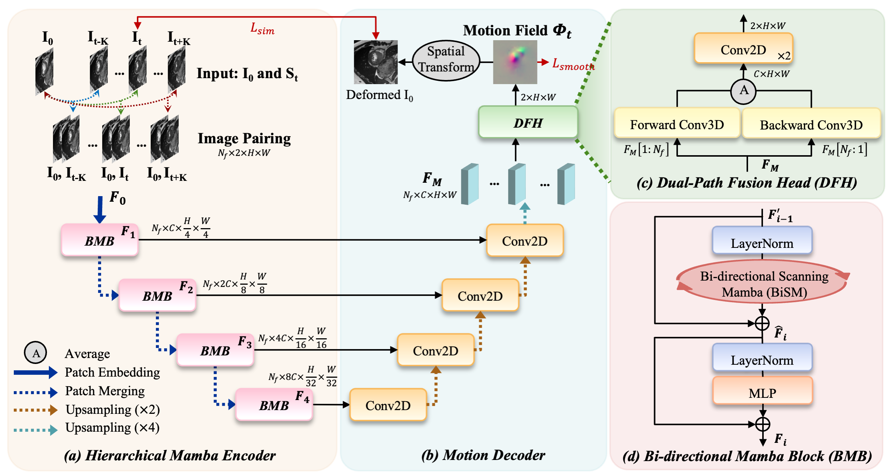
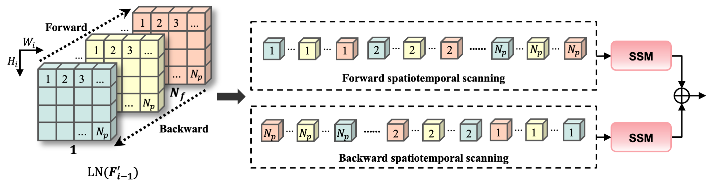

# MCM: Mamba-based Cardiac Motion Tracking using Sequential Images in MRI
MCM: Mamba-based Cardiac Motion Tracking using Sequential Images in MRI
[[arXiv](https://arxiv.org)]

## Overview 

An overview of the proposed MCM:



The proposed bi-directional scanning Mamba (BiSM):



## Environment Setup
```bash
conda create -n mcm python=3.10
conda activate mcm
pip install -r requirements.txt
```

## Training
To train your own dataset, please modify 'data_root' first. To train the example data, please directly run: 
```bash
python train.py 
```

## Cite
If you find it useful, please cite
~~~
@inproceedings{yin2025mcm,
  title={MCM: Mamba-based Cardiac Motion Tracking using Sequential Images in MRI},
  author={Yin, Jiahui and Cheng, Xinxing and Duan, Jinming and Pang, Yan and O'Regan, Declan and Reynaud, Hadrien and Meng, Qingjie},
  booktitle={28th International Conference on Medical Image Computing and Computer Assisted Intervention},
  year={2025},
  organization={Springer}
}
~~~
